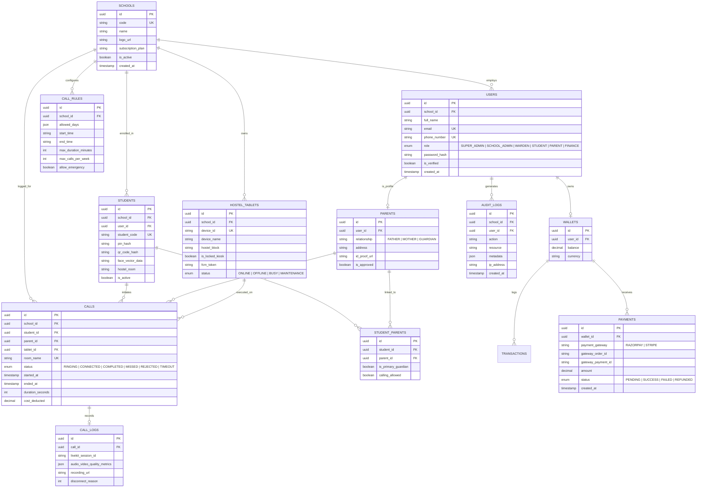

# HostelConnect – Database Entity Relationship Diagram (ERD)

## Mermaid ER Diagram

```mermaid
erDiagram
    SCHOOLS ||--o{ USERS : employs
    SCHOOLS ||--o{ STUDENTS : enrolled_in
    SCHOOLS ||--o{ HOSTEL_TABLETS : owns
    SCHOOLS ||--o{ CALL_RULES : configures
    SCHOOLS ||--o{ CALLS : logged_for

    STUDENTS ||--o{ STUDENT_PARENTS : linked_to
    PARENTS ||--o{ STUDENT_PARENTS : linked_to

    USERS ||--o| PARENTS : is_profile
    USERS ||--o| WALLETS : owns

    WALLETS ||--o{ TRANSACTIONS : logs
    WALLETS ||--o{ PAYMENTS : receives

    STUDENTS ||--o{ CALLS : initiates
    PARENTS ||--o{ CALLS : receives
    HOSTEL_TABLETS ||--o{ CALLS : executed_on

    CALLS ||--o| CALL_LOGS : records
    USERS ||--o{ AUDIT_LOGS : generates

    SCHOOLS {
        uuid id PK
        string code UK
        string name
        string logo_url
        string subscription_plan
        boolean is_active
        timestamp created_at
    }

    USERS {
        uuid id PK
        uuid school_id FK
        string full_name
        string email UK
        string phone_number UK
        enum role "SUPER_ADMIN | SCHOOL_ADMIN | WARDEN | STUDENT | PARENT | FINANCE"
        string password_hash
        boolean is_verified
        timestamp created_at
    }

    STUDENTS {
        uuid id PK
        uuid school_id FK
        uuid user_id FK
        string student_code UK
        string pin_hash
        string qr_code_hash
        string face_vector_data
        string hostel_room
        boolean is_active
    }

    PARENTS {
        uuid id PK
        uuid user_id FK
        string relationship "FATHER | MOTHER | GUARDIAN"
        string address
        string id_proof_url
        boolean is_approved
    }

    STUDENT_PARENTS {
        uuid id PK
        uuid student_id FK
        uuid parent_id FK
        boolean is_primary_guardian
        boolean calling_allowed
    }

    HOSTEL_TABLETS {
        uuid id PK
        uuid school_id FK
        string device_id UK
        string device_name
        string hostel_block
        boolean is_locked_kiosk
        string fcm_token
        enum status "ONLINE | OFFLINE | BUSY | MAINTENANCE"
    }

    CALL_RULES {
        uuid id PK
        uuid school_id FK
        json allowed_days
        string start_time
        string end_time
        int max_duration_minutes
        int max_calls_per_week
        boolean allow_emergency
    }

    CALLS {
        uuid id PK
        uuid school_id FK
        uuid student_id FK
        uuid parent_id FK
        uuid tablet_id FK
        string room_name UK
        enum status "RINGING | CONNECTED | COMPLETED | MISSED | REJECTED | TIMEOUT"
        timestamp started_at
        timestamp ended_at
        int duration_seconds
        decimal cost_deducted
    }

    CALL_LOGS {
        uuid id PK
        uuid call_id FK
        string livekit_session_id
        json audio_video_quality_metrics
        string recording_url
        int disconnect_reason
    }

    WALLETS {
        uuid id PK
        uuid user_id FK
        decimal balance
        string currency
    }

    PAYMENTS {
        uuid id PK
        uuid wallet_id FK
        string payment_gateway "RAZORPAY | STRIPE"
        string gateway_order_id
        string gateway_payment_id
        decimal amount
        enum status "PENDING | SUCCESS | FAILED | REFUNDED"
        timestamp created_at
    }

    AUDIT_LOGS {
        uuid id PK
        uuid school_id FK
        uuid user_id FK
        string action
        string resource
        json metadata
        string ip_address
        timestamp created_at
    }
```
